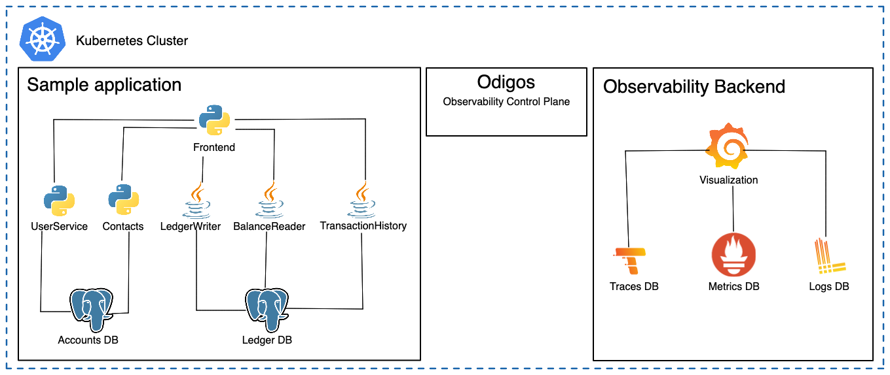
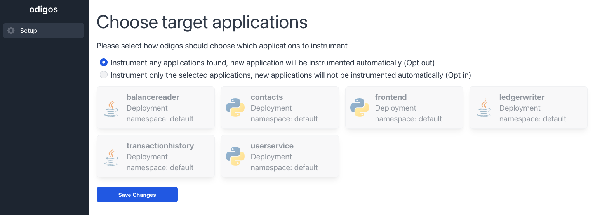
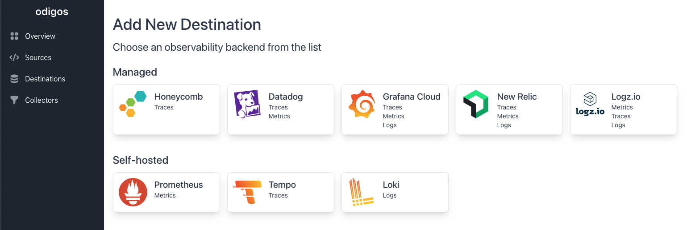
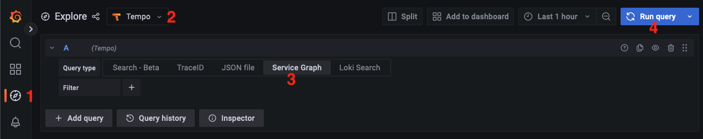
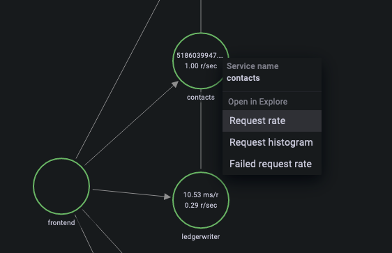
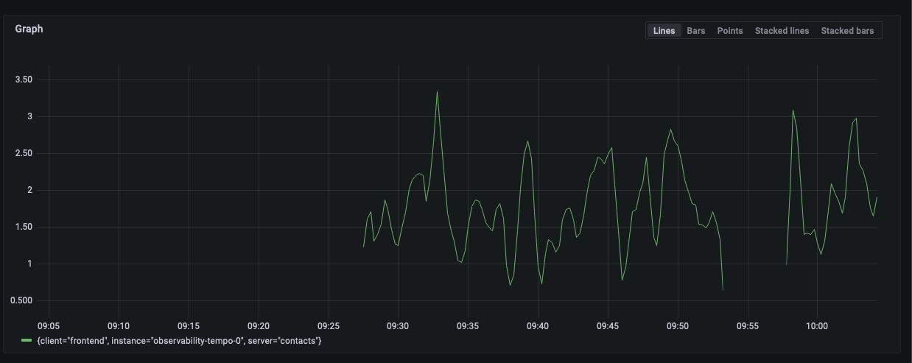
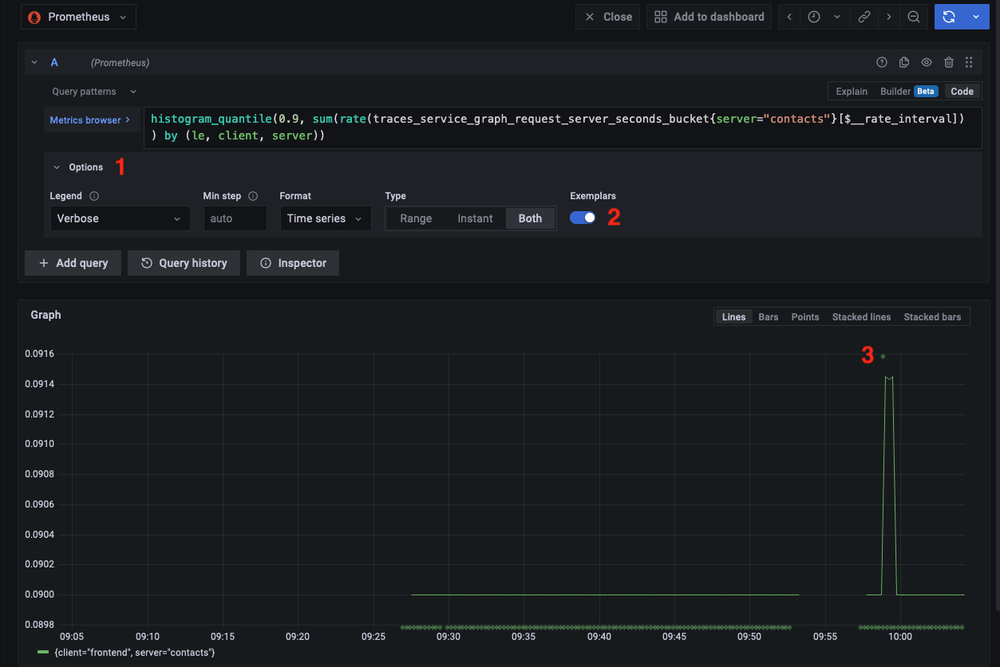
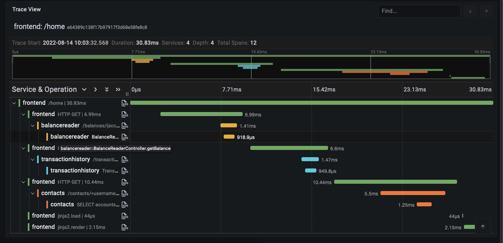

In this blog post, you will learn how to build a complete open-source solution for extracting and shipping traces, metrics, and logs, and correlating between them. The solution proposed uses open-source tools: Grafana, Prometheus, Tempo, and Loki as an observability backend stack, and Odigos as an observability control plane.

## Theory

If you are new to observability, or just interested in the difference between monitoring and observability we recommend watching [this short video](https://www.youtube.com/watch?v=_OXYCzwFd1Y) by the creator of OpenTelemetry. In short, distributed traces, metrics, and logs, with the ability to correlate between one signal to another, are the best practice for debugging production issues when working with microservices-based applications. This is exactly what we are going to achieve for our demo application.

There is no need to learn any new technologies in order to implement and enjoy observability. With some basic Kubernetes commands — you are ready to get started.

## Solution Overview

We are going to deploy 3 different systems on our Kubernetes cluster:

- **Target application** — we will use a microservices-based application written in Java and Python. (for example applications with more programming languages and more complex architecture, use the example from the Odigos [getting started guide](https://odigos.io/docs/getting-started/))
- **Observability backend** — we are going to use the following applications to store and analyze our observability data: - Grafana: for dashboards and visualization of the data - Prometheus: for storage of metrics data - Loki: for storage of logs data - Tempo: for storage of distributed tracing data
- **Observability control plane** — we will use Odigos for automatic instrumentation of our applications (automatic extraction of traces, metrics, and logs), collectors deployment, and configuration.



## Prerequisites

The following tools are required to run this tutorial:

- [Kind](https://kind.sigs.k8s.io/) to run a local Kubernetes cluster with Docker container nodes.
- [Kubernetes CLI (kubectl)](https://kubernetes.io/docs/tasks/tools/install-kubectl/) to run commands against Kubernetes clusters.
- [Helm CLI](https://helm.sh/docs/intro/install/) to install Odigos and the observability backend using helm charts.

## Creating the Kubernetes cluster

Create a new local Kubernetes cluster, by running the following command:

```console
kind create cluster
```

## Installing Target Applications

We will install a fork of [bank-of-athnos](https://github.com/keyval-dev/bank-of-athnos), an example of a bank application created by Google. We use a modified version without any instrumentation code to demonstrate how Odigos automatically collects observability data from the application.

Deploy the application using the following command:

```console
kubectl apply -f https://raw.githubusercontent.com/keyval-dev/bank-of-athnos/main/release/kubernetes-manifests.yaml
```

## Installing Observability Backend

As there is currently no one database that can store traces, logs, and metrics, we will deploy three different databases alongside Grafana as a visualization tool.

The following helm chart deploy Tempo (traces database), Prometheus (metrics database), and Loki (logs database) as well as a preconfigured Grafana instance with those databases as data sources. Install the helm chart by executing:

```console
helm install --repo https://keyval-dev.github.io/charts observability oss-observability --namespace observability --create-namespace
```

## Connecting Everything Together Using Odigos

Now that our test application is running, our observability databases are deployed and ready to receive data, the last piece of the puzzle is to extract and ship logs, metrics, and traces from our applications to the observability databases. The simplest and easiest way to do it is by using Odigos- a control plane for observability data. Install Odigos via the helm chart by executing the following commands:

```console
helm repo add odigos https://keyval-dev.github.io/odigos-charts/
helm install my-odigos odigos/odigos --namespace odigos-system --create-namespace
```

After all the pods in the `odigos-system` namespace are running, open the Odigos UI by running the following command:

```console
kubectl port-forward svc/odigos-ui 3000:3000 -n odigos-system
```

And navigate to [http://localhost:3000](http://localhost:3000) to access the UI.

## Selecting Applications

There are two ways to select which applications Odigos should instrument:

- Opt out (recommended): Instrument everything, including every new application that will be deployed going forward. Users can still manually mark applications that should not be instrumented
- Opt In: Only instrument the applications selected manually by the user.



For this tutorial, we recommend choosing the opt out mode.

## Choosing Destinations


The next step is to tell Odigos how to reach the three databases that we deployed earlier. Add the following three destinations:

### Tempo

- **Name**: tempo (you can choose any name you would like)
- **URL**: http://observability-tempo.observability

### Prometheus

In order to add another destination, select Destinations from the sidebar and click Add New Destination

- **Name**: prometheus
- **URL**: http://observability-prometheus-server.observability

### Loki

- **Name**: loki
- **URL**: http://observability-loki.observability

## Exploring The Data

Wait a few seconds for Odigos to finish deploying the required collectors and instrument the target applications. You can monitor the progress by running

```console
kubectl get pods -w
```

Wait for all the pods to be in `Running` state (especially notice the transactionservice application which has a slow startup time).

The last step is to explore our observability data in Grafana. We can now see and correlate metrics to traces to logs in order to dive deeply into how our application behaves.

### Connecting to Grafana

Port forward to your Grafana instance by running:

```console
kubectl port-forward svc/observability-grafana -n observability 3000:80
```

And navigating to [http://localhost:3000](http://localhost:3000)

- Enter admin as the username
- For the password enter the output of the following command:

```console
kubectl get secret -n observability observability-grafana -o jsonpath=”{.data.admin-password}” | base64 --decode
```

## Service Graph

Let’s start by viewing a service graph of our microservices application:

1. Go to the Explore from the sidebar
2. Select Tempo as datasource
3. Choose the Service Graph tab
4. Run the query



## Metrics

Now let’s view some metrics. Click on the contacts node from the service graph and choose Request rate


A graph similar to the following should be presented:


There are many more metrics that Odigos collect and can be queried easily from the Prometheus data source, check out [this document](https://odigos.io/docs/telemetry-types/) for the full list.

## Traces

Click on the contacts application again in the Service Graph but this time choose Request Histogram. In order to correlate metrics to traces, we will use a feature called exemplars. To show exemplars:

1. Open the options menu
2. Turn on exemplars
3. Notice that the histogram is now added with green diamonds.



Hover over one of the added points and click **Query With Tempo**. A trace similar to the following should be presented:


In this trace, you can see exactly how much time each part of the entire request took. Digging into one of the sections will show additional information such as database queries.

## Logs

To further investigate specific action you can simply query the relevant logs by pressing on the small document icon. Press on the document icon next to the balancereader to show the relevant logs:


## Summary

We have shown how easy it is to extract and ship logs, traces, and metrics using only open-source solutions. In addition, we were also able to generate traces, metrics, and logs from an application within minutes. We now also have the ability to correlate between the different signals: We correlated metrics to traces and traces to logs. We now have all the needed data to quickly detect and fix production issues in our target applications.

## What’s Next?

Notice that the observability backend that we installed is not suited for production usage. For high volumes of data, it is recommended to persist those databases to cloud storage like S3 or use a managed offering.
