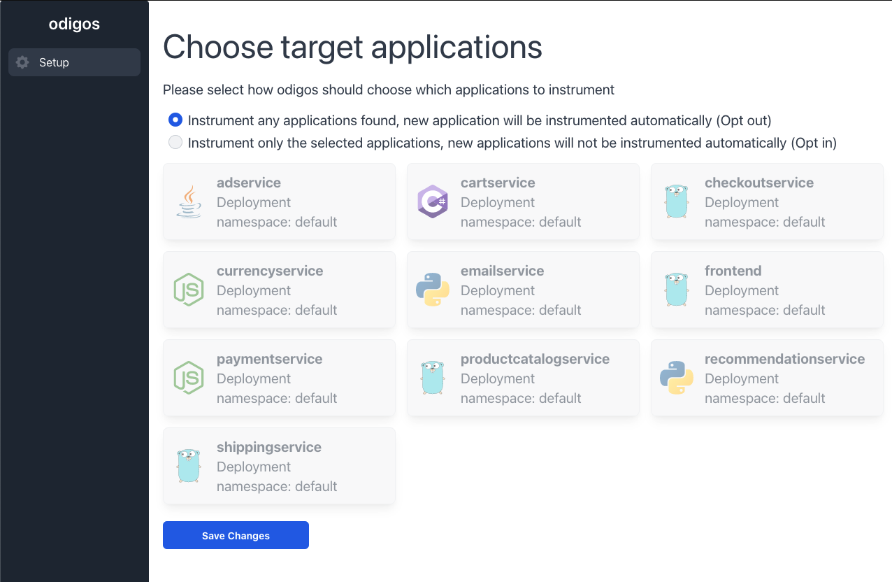

In this tutorial we are going to use Odigos for getting automatic observability of a microservices application written in Go, Java, Python, .NET and Node.js. We will also send and explore all the collected data in Datadog.

{}
Datadog is used as an example to demonstrate Odigos capabilities.
{}

## Prerequisites

To follow the guide, you need the following:

- **A Kubernetes cluster**. We recommend [Kubernetes kind](https://kind.sigs.k8s.io/docs/user/quick-start/) for trying Odigos out in a local development environment.
- **Helm CLI**. We are going to install Odigos using a helm chart.
- **A Datadog account with API key**. Go to [Datadog website](https://datadoghq.com) to create a new free account. In addition, create a new API key by navigating to _Organization settings_, then click on _API keys_, and create a new key.

## Deploying the target application

We are going to install a fork of [microservices-demo](https://github.com/keyval-dev/microservices-demo), an example of e-commerce application created by Google.
We use a modified version **without any instrumentation code** to demonstrate how Odigos automatically collects observability data from the application.

Deploy the application using the following command:

```console
kubectl apply -f https://raw.githubusercontent.com/keyval-dev/microservices-demo/master/release/kubernetes-manifests.yaml
```

Before moving to the next step, make sure that all the application pods are running (may take a few moments).

## Installing Odigos

The easiest way to install Odigos is to use the helm chart:

```shell
helm repo add odigos https://keyval-dev.github.io/odigos-charts/
helm install my-odigos odigos/odigos --namespace odigos-system --create-namespace
```

After all the pods in the `odigos-system` namespace are running, open the Odigos UI by running the following command:

```console
kubectl port-forward svc/odigos-ui 3000:3000 -n odigos-system
```

And navigate to [http://localhost:3000](http://localhost:3000)

## Choosing where to send the data

You should now see the following page:



After Odigos detected all the applications in the cluster, choose the **opt out** option for applications instrumentation.
Opt in mode is recommended when you want to have greater control over which applications are instrumented.

On the next page, select Datadog as the destination for the data. You will be required to fill in the following information:

- **Name**: some unique name for the destination.
- **Site**: This is the domain used for your datadog account, in our exaple it is `us5.datadoghq.com`. ([list of available sites](https://docs.datadoghq.com/getting_started/site/))
- **API Key**: The api key created in the previous step.

## Generating data

That's it! Odigos will automatically do the following:

- Instrument all the applications in the cluster:
  - Runtime langauges will be instrumented using OpenTelemetry instrumentation.
  - Compiled languages will be instrumented using eBPF.
- Deploy and configure a collector to send the data to Datadog.

Now all that is left is to generate some traffic in the application.
Execute the following command to port forward into the application UI:

```console
kubectl port-forward svc/frontend 1234:80 -n default
```

Navigate to [http://localhost:1234](http://localhost:1234) and perform some purchases.

## Exploring the collected data

In a few minutes, you should see distributed traces in Datadog APM.
You now have all the data needed to understand how your application is behaving, without having to do any additional work.

Any new application deployed to this Kubernetes cluster will automatically be instrumented and sent to Datadog.

## Cleanup

Delete the Kubernetes cluster by running the following command:

```console
kind delete cluster
```
